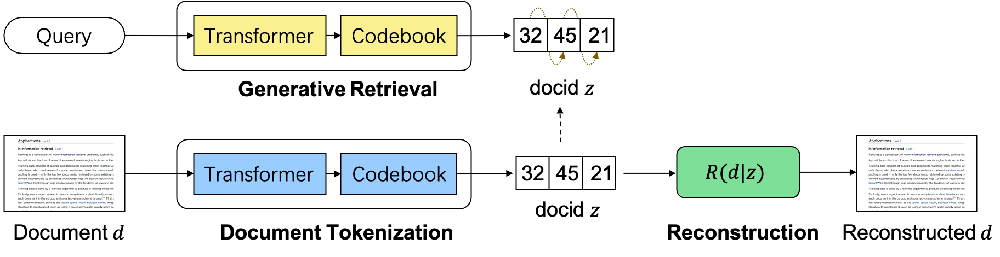

# Learning to Tokenize for Generative Retrieval

## Instructions

- unzip `dataset/nq320k.zip` 
- python baseline.py
  - you will see it print "data size=1404763" and one case (query + doc_id + doc_id token) like this:
  ```
    data size=1404763
    which of the following is not the unit of a stress</s>
    ==>
    Toughness In materials science and metallurgy, toughness is the ability of a material to absorb energy and plastically deform</s> tensor([  332,  4607,   655,    86,  1397,  2056,    11,     3, 22610,   450,
              122,    63,     3,     6,  3429,   655,    19,     8,  1418,    13,
                3,     9,  1037,    12,  8074,   827,    11,  2343,  1427,    20,
           2032,     1])
  ```
  - it requires 1h to train on a single A800 card for 1 epoch.
- using `accelerate launch python baseline.py --multi_gpu` to test multiple gpu.


Code of the paper [Learning to Tokenize for Generative Retrieval](https://arxiv.org/abs/2304.04171).



## Environment
pytorch, transformers, accelerate, faiss, k_means_constrained

## Dataset
NQ320K: unzip `dataset/nq320k.zip` 

Other datasets coming soon.

## Training and Evaluation
Code for GenRet on NQ320K:
```bash
python run.py --model_name t5-base --code_num 512 --max_length 3 --train_data dataset/nq320k/train.json --dev_data dataset/nq320k/dev.json --corpus_data dataset/nq320k/corpus_lite.json --save_path out/model
```


Code for generative retrieval baselines: `baseline.py`

Code for dense retrieval baselines: `dpr.py`

## Cite
```
@article{Sun2023LearningTT,
  title={Learning to Tokenize for Generative Retrieval},
  author={Weiwei Sun and Lingyong Yan and Zheng Chen and Shuaiqiang Wang and Haichao Zhu and Pengjie Ren and Zhumin Chen and Dawei Yin and M. de Rijke and Zhaochun Ren},
  journal={ArXiv},
  year={2023},
  volume={abs/2304.04171},
}
```


